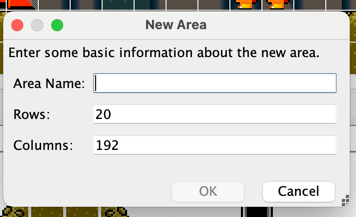
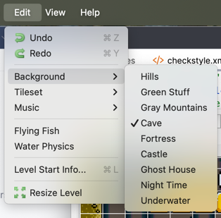
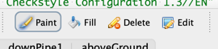
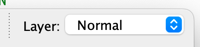
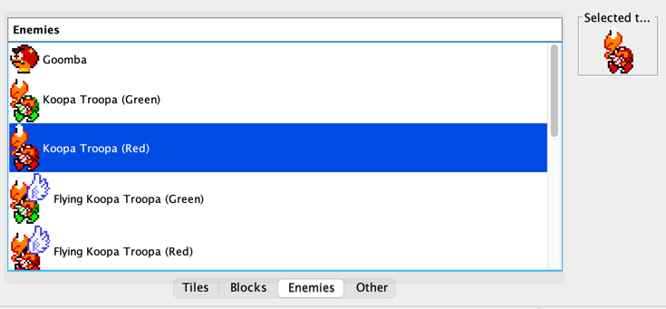
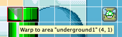
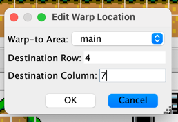
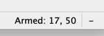
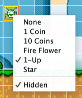

# level-editor - Super Mario Bros. Level Editor
A level editor for this Mario game.

## Debugging via IDE
Start the application (`org.fife.mario.editor.Main`).

To view/edit the levels in the game, open any of the levels in the `mario-slick`
module, such as:

* `../mario-slick/src/main/resources/levels/1-1.txt`.

Each level is stored in a human-readable text file. The level files in
`mario-slick` are the ones packaged and included with the game itself.

## Building the Application
Note this isn't perfect yet, as the application doesn't come bundled with the
resources (it points to the sister `mario-slick` module). Future project
restructuring should resolve this.

Build and run as follows:
```bash
./gradlew clean build installDist
cd level-editor/build/install/level-editor
./bin/level-editor
```

## Using the Editor
**Note:** The editor mostly works, but lacks validation for some actions,
and has some unimplemented features. Features below should be fully implemented
unless otherwise noted. You can check the GitHub issues to see if any bugs or
issues you find are already being tracked.

### Level Definitions
A "level" represents a level in Mario, such as `1-2`, `2-4`, etc. Each level is defined in
a text file, such as `1-1.txt`, and contains the level's name, dimensions, music, tileset,
and more. The level files are currently stored in the game submodule at
`mario-slick/src/main/resources/levels`, but will likely move to their own submodule in
the future.

### Level Makeup
Every level consists of one or more "areas." Each "area" is a part of the level's map;
you should create an "area" for each distinct part of a level (main area, underground pipe 1,
in-the-clouds area, etc.). If you create a new level, it will come with a single
area named `main` by default.

You can add new areas via `Edit` -> `New Area`:



You can change the dimensions, music, tileset and more of an area via the `Edit` menu:



In addition, `Level Start Info...` is used if you want Mario to animate into the area
(coming in from a pipe). Note this menu item should be `Area Start Info` and needs to be
renamed.

### Editing an Area
Like many editors, you select tiles from the `Tiles` palette at the bottom and "paint"
them into areas. You have a few options to control how tiles are added in the toolbar:



* `Paint` - Changes tiles when the left mouse button is clicked
* `Fill` - Acts like a paint bucket tool
* `Delete` - Deletes a tile when the left mouse button is clicked
* `Edit` - Currently does nothing

If you make mistakes, you can undo/redo changes via the `Edit` menu or `Cmd+Z`/`Cmd+Y`.

Each area has 3 layers you can edit the tiles in: `Foreground`, `Normal` and `Background`.
Only `Normal` is currently used in the included levels, but the idea is if you wanted
to have some tiles always in front of, or always behind, Mario, you could add them to the
corresponding layer:



You can also configure how the editor renders layers, and which layers it renders, via the
`View` menu.

Besides what tiles make up an area, you can add blocks, enemies, level goal posts
(marking the "end" of a level) and more via tabs in the palette tool:



You can delete enemies, blocks and tiles via the `Delete` mode described above.

### Editor Features
The editor annotates pipes Mario can go down wit shading in the top-right corner, as well as a
tooltip stating where he'll warp to:



To edit where he'll warp to, right-click on one of the two "edge tiles" of the pipe and
select `Edit Warp Location...`:



You'll need to identify the row and column Mario appears at ahead of time. You can do that
by looking at the application's status bar when hovering over tiles in the editor:



If you right-click on a block in the editor, you can modify its contents, as well as
whether it's visible or hidden:



### Saving Levels
Save via `Ctrl+S` / `Cmd+S`, or the `File` menu.
